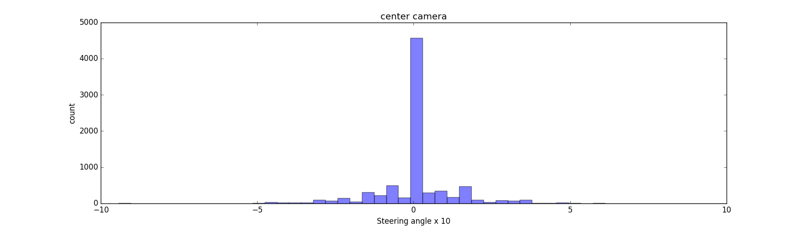

# Dataset 
## Dataset that I used
I found it's hard to genrate the 'good coverage' dataset by myself. But luckily. Udacity offer me a good dataset which has more than 24,000 images. And Center, Left, Right camera each has 8037 images.

## Dig into data

As you can see most of steering angles are 0. I need to find a way to rebalance the dataset.  
Another interesting thing I found is that the image size is 160x320 but the "real useful" infomation is only showed in some certain area which means I can crop and resize the image to keep the region of interest and save the bit.  

```python
# Remove bottom 55 pixels and top 20 pixels. 
# Resize from 160x320 to 42x160
def get_roi(img_data):  
    cropped_image = img_data[55:-20, :, :]   
    image = cv2.resize(cropped_image, (0,0), fx=0.5, fy=0.5). 
    return image  
```


## Augmentation
**1. Flip Image**   
That's what I used in the second project. Flip the image in the left/right direction to augment the dataset. 

```python
def flip_img(img_data):
   return np.fliplr(img_data) 
```
**2. Rotate Image**   
Rotate the image in a random angle.

```python
# roate image in a random angle [-8, -6, 6, 8]
def rotate_img(img_data):
    rotate_angle = random.sample([-8, -6, 6, 8], 1)[0]
    return scipy.ndimage.rotate(img_data, rotate_angle, reshape=False, mode='nearest')
```

**3. Change Brightness**   
In the game I noticed the lighting is changing dynamically. So I can change the brightness of the image to simulate various lighting conditions.

```python
# thanks to Vivek Yadav
# change the brightness with a random number
def change_brightness(img_data):
    image1 = cv2.cvtColor(img_data, cv2.COLOR_RGB2HSV)
    random_bright = 0.25 + np.random.uniform()
    image1[:, :, 2] = image1[:, :, 2] * random_bright
    return cv2.cvtColor(image1, cv2.COLOR_HSV2RGB)
```
*the screenshot shows the augmentation methods I used*


**4. Use left camera images to simulate recovery**  
We can use left or right camera images to simulate the effect of car wandering off to the side. Add 0.25 angle to the steering angle of left camera to simulate to move right to back to center track.  
And I noticed that the steering data has more left turns than the right turn due to the track in the game has more left turns than the right ones. So I only use the left camera images to balance the positive and negative steering angles


### The final dataset I used
I didn't use 'fit_generator' to genrate the training dataset on the fly. Because the ram size in my computer is pretty big and the I crop the image to a  very small resulution the data size is not that big. Very easy to load to the ram. Instead I just used pickle to save the processed image data on the disk which I think can speed-up the training. (But I've written a function that's for generating the training data on the fly by using python generator. The feature is in "data_generator.py". The advangtage of using generator is that in every epoch the network trains a new and augmented dataset. The screenshot shown below is genrated by data_generator.py)  


  

I used center-camera images, rotated center-camera images, flipped center-camera images and left-camera images.


       
Concatenate those four camera images:


As you can see angle 0 and angle 0.25 have larger amount than others. So I need to remove some of them to rebalance the steering angle data.

```python
def remove_data(steering_data, img_data, val=0.0, drop=0.75, is_round=False):
    if is_round:
        target_value_index = np.where(np.round(steering_data, 2)==val)[0]
    else:
        target_value_index = np.where(steering_data==val)[0]
    to_be_delete = random.sample(list(target_value_index), int(len(target_value_index)*drop))
    steering_data = np.delete(steering_data, to_be_delete)
    img_data = np.delete(img_data, to_be_delete, axis=0)
    return steering_data, img_data
```
After removing 95% of angle 0 and 88% of angle 0.25:

       
 
# Training model
I did try lots of different training models to get the best result. Finally I implemented one model architecture which I think is good. I choose ELU as the activation. Becuase it's faster than relu, able to avoid bias shift and bring gradient closer to naural gradient. [link](http://www.picalike.com/blog/2015/11/28/relu-was-yesterday-tomorrow-comes-elu/)

**Input**  42x160x3 with Normalization
 
**Layer 1:** Conv Layer 3x1x1 filters

**Layer 2:** Conv Layer 16x5x5 filters, ELU activation, 2x2 MaxPooling2D, Dropout 0.3  

**Layer 3:**: Conv Layer 32x5x5 filters, ELU activation, 2x2 MaxPooling2D, Dropout 0.3

**Layer 4:**: Conv Layer 48x3x3 filters, ELU activation, 2x2 MaxPooling2D, Dropout 0.3

**Layer 5:**: Flatten Layer 1632 neurons, Dropout 0.5

**Layer 6:**: Fully connected layer with 256 neurons, Dropout 0.3 and ELU activation

**Layer 7:**: Fully connected layer with 128 neurons, Dropout 0.3 and ELU activation

**Layer 8:**: Fully connected layer with 64 neurons, Dropout 0.3 and ELU activation

**Layer 9:**: Fully connected layer with 16 neurons, Dropout 0.3 and ELU activation

**Output**


## Here is my training result
[Youtube Link](https://youtu.be/OLXf1Up3olY)